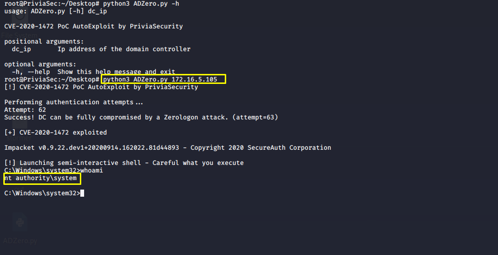

## Açıklama

Zafiyetli şifreleme protokolü, netlogon protokolündeki kimlik doğrulama mekanizması yerine uygulanır. Kimliği doğrulanmayan bir saldırgan, Zerologon güvenlik açığını kullanarak Domain Controller makinesinin bilgisayar hesap parolasını boş (null) olarak oluşturabilir (NT hash = 31d6cfe0d16ae931b73c59d7e0c089c0). Böylece, saldırgan oluşturmuş olduğu kimlik bilgileri ile Domain Controller makinesine erişerek diğer kullancıların kimlik bilgilerini elde edebilir. Yetkili kullanıcılara ait kimlik bilgilerinin elde edilmesiyle Domain Controller makinesinde yüksek yetkilerle oturum elde edilebilir.

## Kurulum
```
python3 -m venv env
source env/bin/activate
pip install -r requirements.txt
```

## Kullanımı

```
python3 ADZero.py dc_ip
```

Privia Security ekibi tarafından geliştirilen ADZero aracı kullanılarak, Zerologon güvenlik açığı bulunan Domain Controller makinesinde `nt authority\system` yetkisiyle Command Prompt oturum elde edilebilir. 

`python3 ADZero.py dc_ip` komutunun çalıştırılmasıyla, `dc_ip` IP adresine sahip Domain Controller makinesinde `Command Prompt` oturumu elde edilir.

ADZero aracı, hedef Domain Controller makinesinin `dc_name` (bilgisayar adı) ve `dom_name` (domain adı) bilgisini elde etmek için kimlik bilgileri null olan bir SMB login isteğinde bulunur. Alınan yanıttan, Domain Controller makinesine ait `dc_name` (bilgisayar adı) ve `dom_name` (domain) bilgisi elde edilebilir.

`dc_name` (bilgisayar adı), `com_name` (bilgisayar adı sonuna `$` sembolünün eklenmesiyle oluşturulan bilgisayar hesabı) ve `dc_ip` (Domain Controller IP adresi) bilgisi kullanılarak güvenlik açığı tetiklenir. Netlogon Remote protokolü üzerinde yapılan istek sonucunda güvenlik açığının tetiklenmesiyle `com_name` (bilgisayar hesabı) parolası boş oluşturulur (NT hash = 31d6cfe0d16ae931b73c59d7e0c089c0).

Impacket modüllerinden biri olan `secretdump.py` modülü kullanılarak `com_name` (bilgisayar hesabı), `dom_name`, `dc_ip` ve `com_name` için oluşturulan boş parola bilgisiyle Domain Controller makinesinden `Administrator` kullanıcısına ait parola bilgisi `LM:NTLM` hash olarak dump edilir. Ayrıca, dump işlemi sırasında elde edilen `LM:NTLM` hash ``out`` adında bir dosyaya yazdırılır.

Elde edilen `LM:NTLM` hash'in Impacket modüllerinden `smbexec.py` modülüyle kullanılması sonucunda Domain Controller makinesinde `Command Prompt` oturumu elde edilir. `LM:NTLM` hash değerinin parola olarak kullanılması tekniğine `Pass The Hash` denir. Domain Controller makinesinde bir meterpreter oturumu, ``out`` adlı dosyaya yazdırılan `LM:NTLM` hash değerinin Metasploit Framework içerisindeki `exploit/windows/smb/psexec` exploit modülüyle kullanılması sonucunda elde edilebilir.

## Ekran Görüntüleri



## Kaynak

https://github.com/blackarrowsec/redteam-research

